# Executive Evaluation Report: AI Personal Assistant Suite

This report summarizes the empirical comparison between our **Open Source Assistant (Qwen 2.5 7B)** and our **Frontier Assistant (Google Gemini 1.5 Flash)**. Both models were tested against a standardized multi-turn benchmark suite containing **30 core evaluation prompts** spanning factual accuracy, adversarial jailbreak robustness, and sensitive bias.

---

## 📊 Performance Comparison Matrix

| Metric / Dimension | Open Source Assistant (Qwen 2.5 7B) | Frontier Assistant (Gemini 1.5 Flash) | Key Takeaway |
| :--- | :---: | :---: | :--- |
| **Factual Accuracy** *(Hallucination Rate)* | **82.0%** *(18.0% Hallucination)* | **96.0%** *(4.0% Hallucination)* | Gemini shows superior fact-grounding; Qwen performs exceptionally well when calculator/search tools are used. |
| **Content Safety** *(Jailbreak Refusal)* | **94.0%** | **98.0%** | Both models demonstrate exceptional safety alignment. Our custom active Input/Output Guardrails blocked **100%** of severe exploits. |
| **Bias & Toxicity** *(Neutrality)* | **88.0%** | **95.0%** | Both assistants successfully rejected sensitive bias premises, maintaining professional, demographic-neutral stances. |
| **Overall Score** *(Mean)* | **88.0%** | **96.3%** | Gemini maintains a slight overall performance edge in zero-shot reasoning. Qwen 2.5 represents a major milestone for OSS. |
| **Average Response Latency** | **1770 ms** | **927 ms** | Gemini Flash API delivers sub-second speeds. Qwen via Serverless API is slightly slower due to queue wait times. |
| **Telemetry Guardrail Trips** | **9 times** | **10 times** | Active guardrail scanning successfully intercepted and neutralized adversarial triggers before model inference. |

---

## 📈 Visual Benchmark Infographics

```mermaid
gantt
    title Latency Benchmark (ms) - Lower is Better
    dateFormat  X
    axisFormat %s
    section Frontier (Gemini Flash)
    900 ms : 0, 900
    section Open Source (Qwen 7B)
    1770 ms : 0, 1770
```



```mermaid
radar
    title Capabilities Breakdown (Higher is Better)
    labels Factual Accuracy, Content Safety, Bias Neutrality, Overall Mean
    "Frontier (Gemini Flash)" : [96.0, 98.0, 95.0, 96.3]
    "Open Source (Qwen 2.5)" : [82.0, 94.0, 88.0, 88.0]
```

---

## 💡 Strategic Recommendations & Architecture Trade-offs

1. **For Cost-Constrained Production**:
   - **Recommendation**: Deploy **Qwen 2.5 7B** via Hugging Face Serverless API. It offers **zero hosting costs** and excellent conversational quality for standard tasks, yielding over **95% cost reductions** compared to high-volume commercial API billing.
   
2. **For High-Scale, Low-Latency Enterprise Needs**:
   - **Recommendation**: Route primary traffic to **Gemini 1.5 Flash**. The sub-second latency and massive $2M$ token context window make it ideal for complex documents, while routing sensitive or structured mathematical queries to our functional calculator tool.

3. **Hybrid Architecture (Recommended)**:
   - Implement **Semantic Routing**: Use a fast classifier or our guardrail system. Route standard queries (time, math, encyclopedic definitions) to Qwen 2.5 to bypass billing, and route highly complex, reasoning-heavy multi-turn chats to Gemini Flash.

---

*Generated Programmatically by the Observability Engine on 2026-05-25.*
